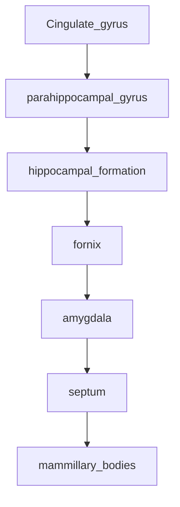

```toc
```

## Neurons

### Types of neurons
There are a shit ton of neurons in our brains. And lots of different types. They are discriminated by their morphology, physiology (firing pattern) and molecular signature.
![[Pasted image 20230116142203.png]]

### Neuron schematic
![[Pasted image 20230116142733.png]]

#### Components
##### Axon
![[Pasted image 20230116143806.png]]
The long projection of the cell, conducts the [[action potentials]]. May be [myelinated](https://en.wikipedia.org/wiki/Myelin "Myelin"), or unmyelinated. This is the provision of an insulating layer, called a myelin sheath. The myelin membrane is unique in its relatively high lipid to protein ratio.

##### Boutons

##### Cleft
##### Dendritic spines
##### Postsynaptic membrane
##### Vesicles
##### Transmitter
##### Receptors
- Ligand gated ion channels (fast process)
![[Pasted image 20230116145429.png]]
- Gprotein coupled (slow process)
![[Pasted image 20230116145528.png|400]]
##### Dendrites
Input of the neuron
![[Pasted image 20230116145840.png|400]]
##### Flow of the neuron
![[Pasted image 20230116145953.png|400]]
## [[Nervous systems]]
## Neurotransmitters
One neuron only releases one kind of NT.

![[Drawing 2023-01-16 14.50.57.excalidraw.svg]]

## The skull
![[Pasted image 20230117123046.png|400]]
Protection, supports the sensory organs (eyes, ears)

### The meninges
Protection and sustenance of the brain. Made up of three layers:
- Dura mater 
- Arachnoïd
- Pia mater
![[Pasted image 20230117123157.png|400]]

## Ventricular system
Provides chemical protection and nurtition by supplying the cerebro spinal fluid via the choroid plexus.
![[Pasted image 20230117123419.png|400]]

## [[Neural development]]

## Major divisions of the brain

![[Organization of the brain 2023-01-17 12.44.42.excalidraw.svg]]

The myelencephalon is responsible for breathing and vital functions

## Cranial nerves
The 12 cranial nerves connect the brain with the periphery. Cranial nerves send electrical signals between your brain, face, neck and torso. Your cranial nerves help you taste, smell, hear and feel sensations. They also help you make facial expressions, blink your eyes and move your tongue.
![[Pasted image 20230117125450.png|300]]
![[Pasted image 20230117125734.png|500]]

## Limbic system
Part of the brain involved in behavioural and emotional responses (survival responses). Fear conditioning

### Broca's limbic lobe
![[Pasted image 20230117131305.png|400]]
(Cingulate gyrus and parahippocampal gyrus) 
Associated with the sense of smell (size varies between species with the size of the olfactory nerve)

### Papez circuit (same thing but described more precisely)
Also called the visceral brain.
This neural loop functions in the cortical control of emotion, memory storage and contains centers that regulate aversion and gratification.
The Papez circuit goes through the following neural pathways:

[Hippocampal formation](https://en.wikipedia.org/wiki/Hippocampal_formation "Hippocampal formation") ([subiculum](https://en.wikipedia.org/wiki/Subiculum "Subiculum")) → [fornix](https://en.wikipedia.org/wiki/Fornix_of_the_brain "Fornix of the brain") → [mammillary bodies](https://en.wikipedia.org/wiki/Mammillary_body "Mammillary body") → [mammillothalamic tract](https://en.wikipedia.org/wiki/Mammillothalamic_fasciculus "Mammillothalamic fasciculus") → [anterior thalamic nucleus](https://en.wikipedia.org/wiki/Anterior_nuclei_of_thalamus "Anterior nuclei of thalamus") → [cingulum](https://en.wikipedia.org/wiki/Cingulum_(brain) "Cingulum (brain)") → [entorhinal cortex](https://en.wikipedia.org/wiki/Entorhinal_cortex "Entorhinal cortex") → hippocampal formation.
**Function:**
- Emotional expression
- Memory acquisition
- Fear conditioning
- Violence and aggression 

### Amygdala 
The amygdala is **the integrative center for emotions, emotional behavior, and motivation**
When removed we can't recognize fear anymore


## Hypothalamus and thalamus

### Thalamus 
Is part of the of the upper brain stem (Diencephalon)

**Structure**
- Two symmetric large nuclei
- Receive ascending and descending inputs
- Many projections

**Function**
- Relay station
- Domain specific information processing

### Hypothalamus
![[Pasted image 20230117141721.png|400]]
**Structure**
- Very small
- Contains an important collection of nuclei

**Function**
- Controls autonomic mechanisms
- Link to endocrine system

## Basal ganglia

![[Pasted image 20230117142424.png|400]]
**Structure**
- Collection of nuclei embedded deep within cortex
- Partially surrounds the thalamus
- Sensory projections to cerebrum
- Efferents to other nervous system structures
- Consists of:
	- Caudate nucleus
	- Putamen
	- Globus pallidus
	- Substantia niagra
	- Subthalamic nucleus
	
**Function**
- Regulate voluntary movement
- Integrative or just relay station?

**Pathology**
- Movement disorders (Parkinsons)

## Lobes of the cerebral cortex
![[Pasted image 20230117142803.png|400]]
## Cytoarchitecture
Six layers of neurons (gray matter)
![[Pasted image 20230117142840.png|400]]
![[Pasted image 20230117142901.png|400]]
### Brodmann's areas
Different morphological areas somehow reflecting their function
![[Pasted image 20230117143114.png|400]]
## Cortical areas

### Phineas Gage
Accident in 1848 destroyed left frontal lobe. "The equilibrium or balance, so to speak, between his intellectual faculties and animal propensities, seems to have been destroyed.”

### Occipital lobe
WHen damaged vision is impaired

## Circuits
Layer 4 is generally the input layer. Feedback is usually generated by layer 5 and 6 into layer 2 and 3
![[Pasted image 20230117143231.png|400]]